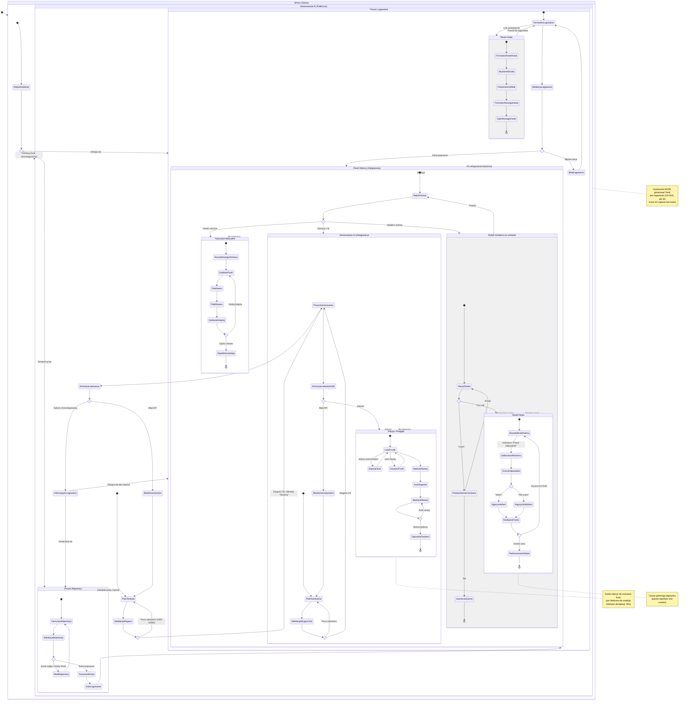

# Diagram Podróży Użytkownika - Generator Fiszek AI

Ten diagram przedstawia kompleksową podróż użytkownika przez aplikację Generator Fiszek AI, obejmując wszystkie główne przepływy: autentykację, generowanie fiszek przez AI, zarządzanie zestawami i naukę.

## Kluczowe Ścieżki

1. **Niezalogowany użytkownik** - może generować fiszki, ale nie może ich zapisać
2. **Rejestracja** - tworzenie nowego konta z walidacją
3. **Logowanie** - uwierzytelnianie z opcją resetowania hasła
4. **Generowanie AI** - główny przepływ z walidacją tekstu (1000-10000 znaków)
5. **Edycja i podgląd** - przegląd, modyfikacja i usuwanie wygenerowanych fiszek
6. **Tworzenie manualne** - alternatywna ścieżka bez AI
7. **Zarządzanie zestawami** - lista "Moje zestawy" z opcjami nauki i usuwania
8. **Moduł nauki** - spaced repetition z oceną "Wiem"/"Nie wiem"

## Diagram Mermaid

## Szczegóły Implementacyjne

### Punkty Decyzyjne

1. **Czy użytkownik jest zalogowany?**
   - TAK → Dostęp do pełnej funkcjonalności (zapisywanie, zarządzanie, nauka)
   - NIE → Tylko generowanie fiszek bez możliwości zapisu

2. **Czy tekst ma odpowiednią długość?** (1000-10000 znaków)
   - TAK → Przycisk "Generuj" aktywny
   - NIE → Przycisk nieaktywny, wyświetlany licznik

3. **Czy dane logowania/rejestracji są poprawne?**
   - TAK → Przekierowanie do panelu głównego
   - NIE → Wyświetlenie komunikatu błędu

4. **Czy generowanie zakończyło się sukcesem?**
   - TAK → Przekierowanie do edycji
   - NIE → Komunikat błędu z sugestiami

### Metryki Analityczne

- **Wydarzenie:** `fiszka_usunięta_w_edycji` - śledzone dla obliczenia wskaźnika akceptacji
- **Cel:** 75% akceptacji fiszek AI (obliczane jako `1 - (usunięte/wygenerowane)`)
- **Źródło:** Każdy zestaw oznaczony jako "AI" lub "manual"

### Uwagi Techniczne

- Reset hasła wymaga wysłania emaila weryfikacyjnego
- Automatyczna sugestia nazwy zestawu oparta na analizie tekstu źródłowego
- Algorytm spaced repetition: użycie gotowego rozwiązania open-source (np. SM-2)
- Niezalogowani użytkownicy widzą komunikat o konieczności zalogowania po wygenerowaniu fiszek
